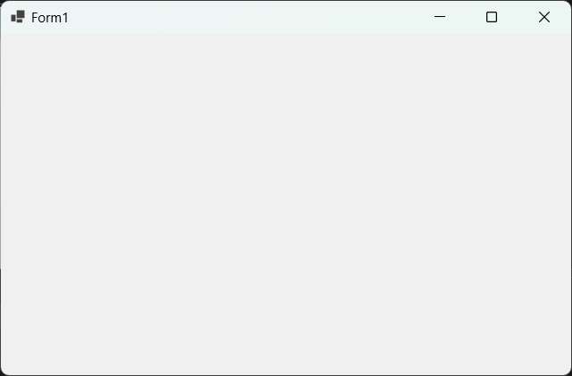

# Introduction

Bienvenue dans ce tutoriel consacré à la présentation du processus de
conception d’un oscilloscope en C# avec Windows Forms sous Visual Studio.

# Configuration du package C# dans Visual Studio

*	Nous ouvrons la fiche d’installation des outils et des fonctionnalités dans l’éditeur (Visual Studio).

// Visual Studio
```
Outils > Obtenir les outils et fonctionnalités
```

*	Nous sélectionnons le package (Développement .NET Desktop) pour développer des projets en C# dans l’éditeur (Visual Studio).

// Visual Studio
```
Cocher > Développement .NET Desktop
```

*	Nous cliquons sur le bouton (Modifier) pour démarrer l’installation du package dans l’éditeur (Visual Studio).

// Visual Studio
```
Modifier
```

*	Nous cliquons sur le bouton (Oui) pour autoriser l’installation du package dans l’éditeur (Visual Studio).

// Visual Studio
```
Oui
```

# Création d’un projet C# Windows Forms dans Visual Studio

*	Nous ouvrons la fiche de création de projet dans l’éditeur (Visual Studio).

// Visual Studio
```
Fichier > Nouveau > Projet
```

*	Nous sélectionnons le langage (C#) dans l’éditeur (Visual Studio).

// Visual Studio
```
Tous les langages > C#
```

*	Nous sélectionnons la plateforme (Windows) dans l’éditeur (Visual Studio).

// Visual Studio
```
Toutes les plateformes > Windows
```

*	Nous sélectionnons le type de projet (Bureau) dans l’éditeur (Visual Studio).

// Visual Studio
```
Tous les types de projet > Bureau
```

*	Nous sélectionnons le modèle de projet (Application Windows Forms) dans l’éditeur (Visual Studio).

// Visual Studio
```
Modèle de projet > Application Windows Forms
```

*	Nous cliquons sur le bouton (Suivant) pour continuer la procédure dans l’éditeur (Visual Studio).

// Visual Studio
```
Suivant
```

*	Nous définissons le nom du projet (OscilloscopeGUI) dans l’éditeur (Visual Studio).

// Visual Studio
```
Nom de projet > OscilloscopeGUI
```

*	Nous définissons l’emplacement du projet (v01) dans l’éditeur (Visual Studio).

// Visual Studio
```
Emplacement > v01
```

*	Nous définissons le nom de la solution (OscilloscopeGUI) dans l’éditeur (Visual Studio).

// Visual Studio
```
Nom de la solution > OscilloscopeGUI
```

*	Nous cliquons sur le bouton (Suivant) pour continuer la procédure dans l’éditeur (Visual Studio).

// Visual Studio
```
Suivant
```

*	Nous sélectionnons l’infrastructure (.NET 8.0) dans l’éditeur (Visual Studio).

// Visual Studio
```
Infrasctructure > .NET 8.0 (Prise en charge à long terme)
```

*	Nous cliquons sur le bouton (Créer) pour créer le projet dans l’éditeur (Visual Studio).

// Visual Studio
```
Créer
```

*	Nous cliquons sur le bouton (Démarrer le débogage) pour exécuter le projet dans l’éditeur (Visual Studio).

// Visual Studio
```
Déboguer > Démarrer le débogage
```


